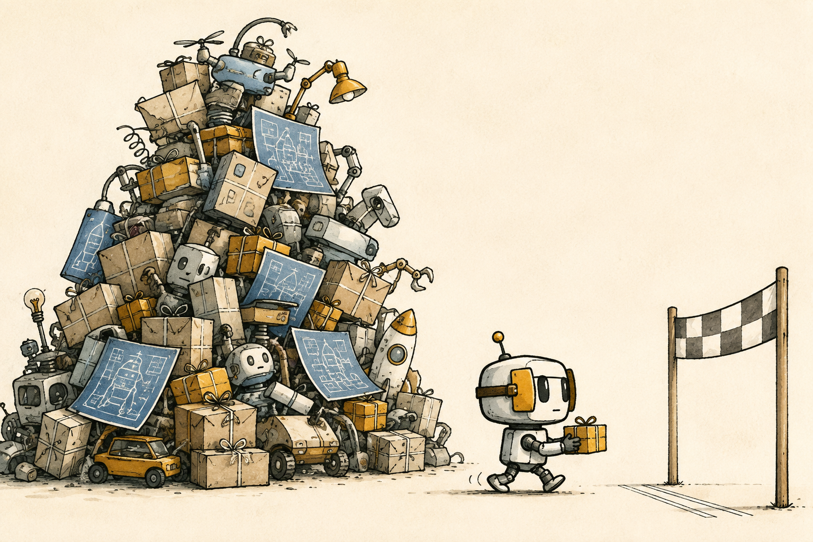
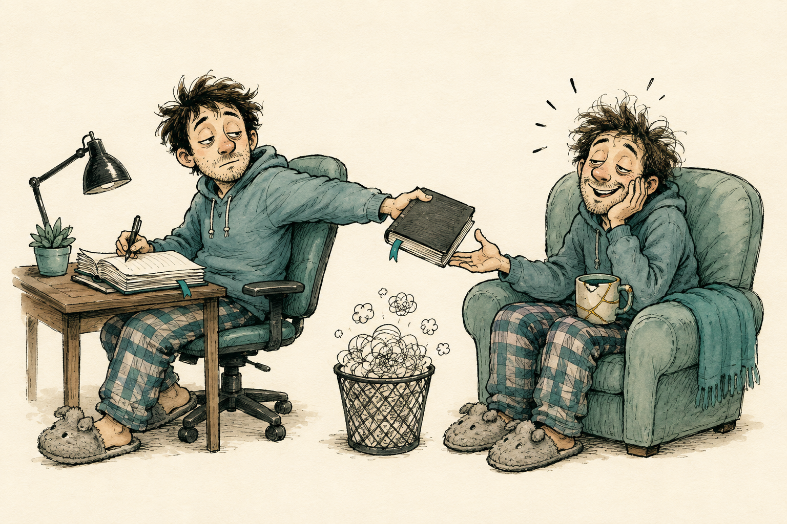

# Artwork notes

Four original illustrations generated for this collection with OpenAI image generation. No third-party artwork is included.

## careless-user-e2e

**Generation prompt**

Use case: illustration-story. Asset: a funny editorial cartoon for a public GitHub agent-skill README. Create an original 3:2 landscape illustration, cream paper background, chunky imperfect black ink outlines, sparse gentle watercolor, warm intelligent deadpan humor, exaggerated readable expressions. Professional editorial drawing with a clear visual joke that reads at thumbnail size. No words, letters, brand marks, logos, watermarks, client information, or software UI text. Do not imitate an existing character or artwork. A competent but distracted tester at a tiny desk is balancing a coffee and croissant while one elbow presses a comically oversized red button on a simple laptop, launching a pile of duplicate blank receipts. Their other hand calmly reaches for a giant undo-shaped curved arrow eraser, ready to repair the mess. The tester's face is innocent and self-assured; a tiny desktop robot watches with one raised eyebrow. The funny point is accidental action followed by deliberate recovery. Muted coral accent. One clean scene, generous empty margin.

## single-thread-execution

**Generation prompt**

Use case: illustration-story. Asset: a funny editorial cartoon for a public GitHub agent-skill README. Create an original 3:2 landscape illustration, cream paper background, chunky imperfect black ink outlines, sparse gentle watercolor, warm intelligent deadpan humor, exaggerated readable expressions. Professional editorial drawing with a clear visual joke that reads at thumbnail size. No words, letters, brand marks, logos, watermarks, client information, or software UI text. Do not imitate an existing character or artwork. An intensely focused small delivery robot wearing horse blinkers carries exactly one tiny neatly wrapped parcel toward a simple finish line. Behind it stands a ludicrous teetering mountain of tempting unfinished gadgets, blueprints, and parcels; it walks right past them with deadpan determination. The comically tiny parcel and huge unused mountain make the joke. Muted mustard accent, one clean scene, generous empty margin.

## worklog

**Generation prompt**

Use case: illustration-story. Asset: a funny editorial cartoon for a public GitHub agent-skill README. Create an original 3:2 landscape illustration, cream paper background, chunky imperfect black ink outlines, sparse gentle watercolor, warm intelligent deadpan humor, exaggerated readable expressions. Professional editorial drawing with a clear visual joke that reads at thumbnail size. No words, letters, brand marks, logos, watermarks, client information, or software UI text. Do not imitate an existing character or artwork. A sleepy developer in slippers writes a short entry in a thick notebook and hands it behind their shoulder to their equally sleepy future self, who receives it with absurd relief. The two characters look alike but have slightly different messy hair; one holds a chipped coffee mug, the other has the matching mug with a small repair. Nearby is a small wastebasket full of tangled thought-cloud doodles. The joke is remembering what yesterday's self already learned. Muted teal accent, one clean scene, generous empty margin.

## claude-codex-pairing

**Generation prompt**

Use case: illustration-story. Asset: a funny editorial cartoon for a public GitHub agent-skill README. Create an original 3:2 landscape illustration, cream paper background, chunky imperfect black ink outlines, sparse gentle watercolor, warm intelligent deadpan humor, exaggerated readable expressions. Professional editorial drawing with a clear visual joke that reads at thumbnail size. No words, letters, brand marks, logos, watermarks, client information, or software UI text. Do not imitate an existing character or artwork. Two distinct eccentric friendly robot colleagues share one tiny desk and exactly one keyboard. One robot types with focused confidence. The other robot bends an enormous magnifying glass over one microscopic punctuation-like dot on a sheet, its hands firmly folded behind its back, conveying review without interfering. The typing robot side-eyes the theatrical inspector. Visual joke about two brains and one pair of editing hands. No recognizable corporate robot likeness or logo. Muted lavender accent, one clean scene, generous empty margin.

## Careless User correction

The first image had an extra arm. A targeted edit removed the arm reaching toward the undo eraser and retained the coffee-holding arm and button-pressing arm. The final image shows exactly two arms.

