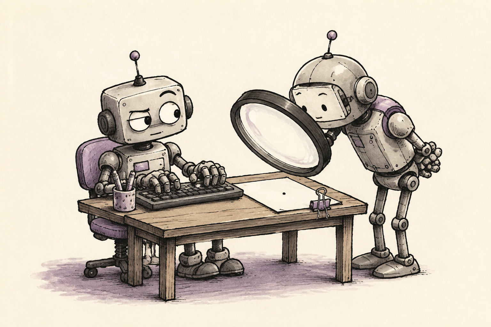

# Claude–Codex Pairing

**Two brains. One keyboard.**



We built this skill to get a useful second opinion without giving two agents ownership of the same files. The active agent owns the work. The peer answers one narrow question and returns evidence. The owner checks that evidence before adopting a finding.

## What it does

A peer call needs a concrete artifact, diff, failure, or question tied to an acceptance criterion. It carries a read-only sentinel, a bounded scope, and the evidence already collected. The peer cannot edit, install, deploy, or call another agent.

There is at most one peer call for the same question. A failed call or missing verdict is reported as a failed check. The skill does not start a chain of agents asking one another for help.

## A useful request

```text
Review whether this correction can count an item twice.
Limit the review to the changed handler and its tests.
Return a reproducible counterexample or explain what evidence rules it out.
```

That gives the reviewer a claim to challenge and a stopping point. The owner's tests and the peer's opinion remain separate evidence.

## Prerequisites

Install the `claude-codex-pairing` folder using the [collection instructions](../../README.md#install-in-codex). The workflow also requires both products to be installed and authenticated through their normal setup.

- **Codex as owner:** a Claude Code CLI supporting `--safe-mode`, non-persistent sessions, and restricted tools. The skill checks authentication first and uses a read-only tool list.
- **Claude Code as owner:** the first-party Codex plugin exposing `/codex:adversarial-review` with `--wait --scope working-tree`, plus a reviewable Git working-tree diff.

The included command forms were checked against Claude Code 2.1.202 help and Codex plugin 1.0.6 command documentation for this release. Check your installed versions' help if a flag or command is unavailable. Installing this skill does not install or authenticate either product. Each peer call uses the corresponding product's account and usage allowance.

## Use it

```text
Use claude-codex-pairing for one read-only review of this diff.
The acceptance criterion is that a repeated save cannot create a duplicate.
Keep the current agent as the only writer and verify any adopted finding.
```

Use it when an independent review can resolve a real uncertainty. Skip tiny edits, isolated facts, and calls that would just repeat the owner's checks. Send only the minimum relevant material, excluding secrets and private records.

[Read the full skill](SKILL.md) · [Back to the collection](../../README.md)
